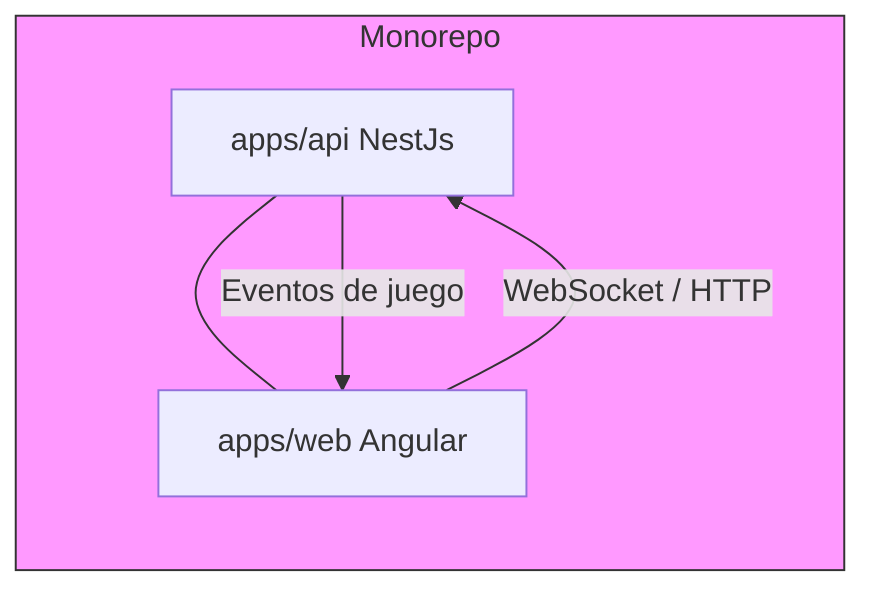
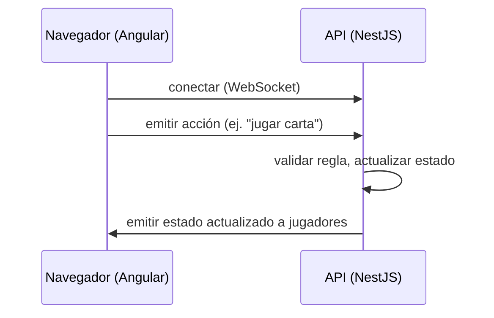

# carioca-online

## Descripción

Carioca Online es un mono-repositorio que contiene dos aplicaciones principales:

- `apps/api`: backend (NestJS) con un gateway de WebSocket para la lógica del juego.
- `apps/web`: frontend (Angular) con componentes para sala (lobby) y partida (game).

Este README describe la arquitectura, cómo poner el proyecto en marcha en desarrollo, y dónde están los archivos principales.

## Diagrama de arquitectura (Mermaid)



## Diagrama de componentes (flujo simplificado)



## Estructura relevante del proyecto

Raíz (resumen):

```
package.json (workspace)
apps/
	api/      # Backend (NestJS)
	web/      # Frontend (Angular)
```

Ficheros importantes en `apps/api/src`:

- `main.ts` — arranque de la app NestJS.
- `app.module.ts` — módulos y configuración.
- `game.gateway.ts` — WebSocket gateway: eventos de juego y comunicación en tiempo real.
- `rooms.service.ts` — lógica de salas/partidas.
- `rules.ts`, `types.ts` — reglas de juego y tipos compartidos.

Ficheros importantes en `apps/web/src/app`:

- `app.routes.ts` — rutas de la aplicación Angular.
- `game.service.ts` — cliente que consume el API/WebSocket.
- Componentes: `game/` y `lobby/` con lógica UI.

## Requisitos previos

- Node.js >= 20 (requerido según `package.json` raíz)
- npm (se usan workspaces)

## Instalación y ejecución en desarrollo

1. Instalar dependencias (en la raíz del repo):

```powershell
npm install
```

2. Ejecutar en modo desarrollo (levanta API y Web en paralelo):

```powershell
npm run dev
```

Comandos útiles (desde la raíz):

- `npm run dev:api` — Ejecuta solo el backend.
- `npm run dev:web` — Ejecuta solo el frontend.
- `npm run build` — Construye ambas aplicaciones.
- `npm run lint` — Corre linter en ambas apps.

Si necesitas correr un workspace individual puedes usar la opción `-w` de npm, por ejemplo:

```powershell
npm run dev -w @carioca/api
```

> Nota: los nombres de paquetes workspace parecen ser `@carioca/api` y `@carioca/web` según el `package.json` raíz.

## Desarrollo y pruebas rápidas

- Backend: mira `apps/api/src/game.gateway.ts` y `rooms.service.ts` para entender el flujo de mensajes y la lógica de salas.
- Frontend: `apps/web/src/app/game.service.ts` es el cliente que se conecta vía WebSocket al gateway.

### Consejos de depuración

- Si el frontend no consigue conectarse al WebSocket, verifica la URL y el puerto en `game.service.ts`.
- Para probar la lógica de reglas, puedes crear scripts pequeños que importen `apps/api/src/rules.ts` (o usar las pruebas unitarias si están disponibles).

## Contribuir

1. Abre un issue describiendo la propuesta o bug.
2. Crea una rama feature/bugfix desde `main`.
3. Añade tests mínimos cuando modifiques lógica compartida (reglas/servicios).
4. Abre un Pull Request explicando cambios y cómo probarlos.

## Licencia

Consulta el fichero `LICENSE` en la raíz del proyecto.

## Notas finales

Si quieres, puedo:

- Añadir diagramas más detallados (PlantUML/PNG) y colocarlos en una carpeta `docs/`.
- Revisar y documentar endpoints concretos del API si me das permisos para leer `apps/api/src` más a fondo.

— Fin del README actualizado —
